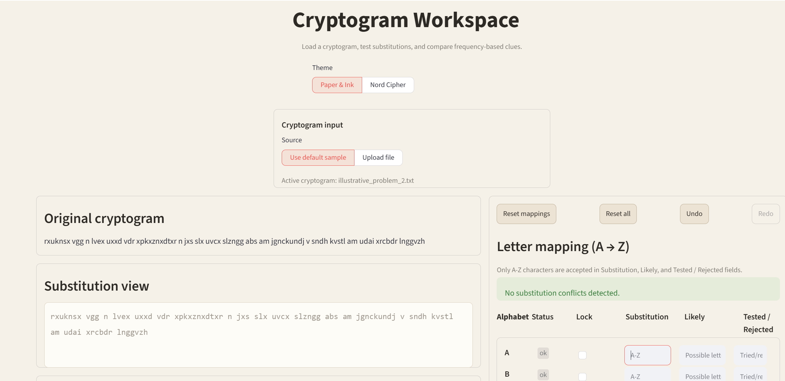
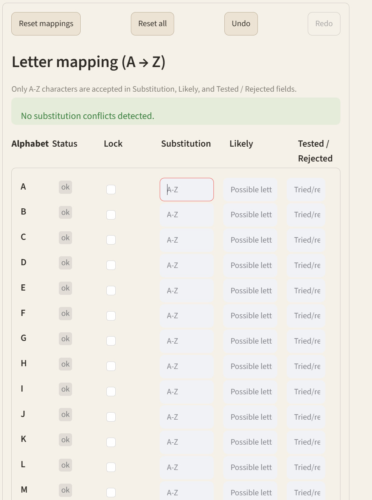
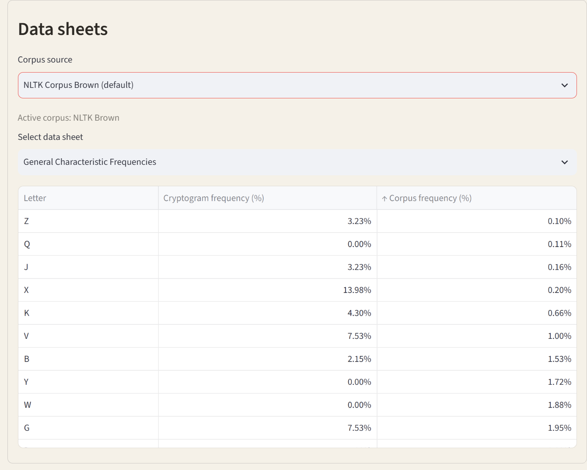
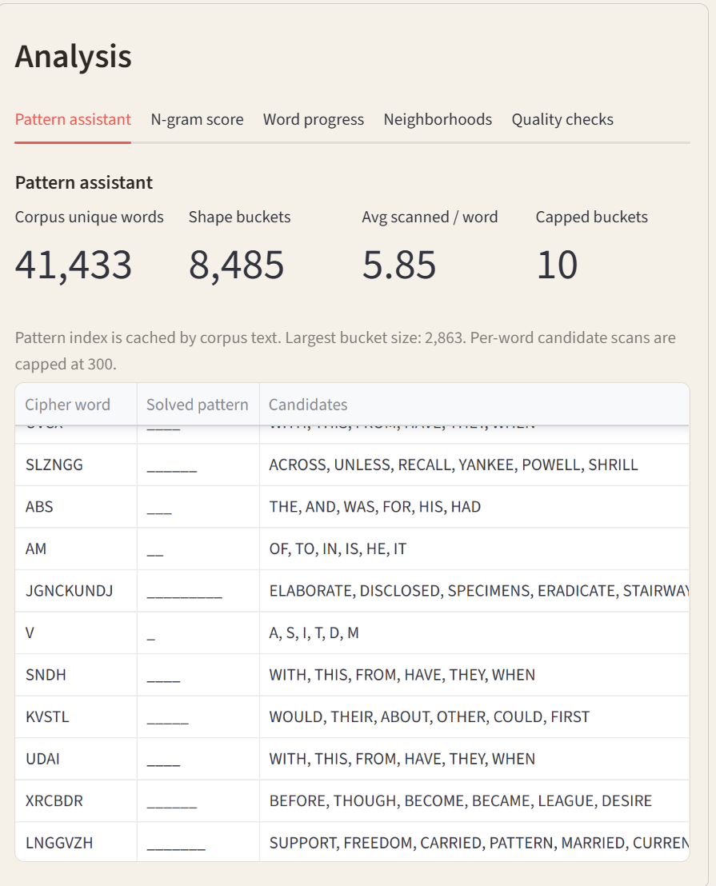
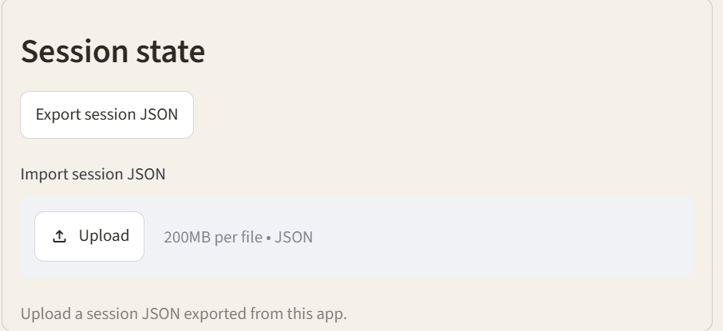

# Cryptogram Workspace

Interactive cryptogram-solving workspace built with Streamlit and corpus-based analysis helpers.

Inspired by the book *Solving Cryptograms: A Scientific Approach* by Ross Hallock, available for purchase [here](https://www.amazon.com/Solving-Cryptograms-Scientific-Ross-Hallock/dp/B0DXY723HT).


## Features

- Original and substitution views of the active cryptogram
- Letter-mapping grid (`A` to `Z`) with lock support and conflict status
- Self-substitution detection (for example, `A -> A`)
- Frequency data sheets (general, initial/terminal, and 2-letter word variants)
- Corpus options using NLTK corpora or uploaded plain-text corpus files
- Analysis tabs for pattern candidates, n-gram score, word progress, neighborhoods, and quality checks
- Undo/redo for mapping changes
- Session state export/import via JSON
- Theme toggle (`Paper & Ink`, `Nord Cipher`)

## Why This Project Stands Out

- Combines puzzle-solving workflow design with language-frequency analysis in one app
- Uses modular rendering and helper functions for maintainability and faster iteration
- Adds practical solving ergonomics such as conflict checks, locks, and reversible edits
- Includes import/export support to preserve and share solving progress

## Tech Stack

- Python
- Streamlit
- Pandas
- NLTK (optional corpus source)

## Project Structure

```text
cryptogram/
├── app.py                           # App entrypoint and UI logic
├── requirements.txt                 # Python dependencies
├── README.md
├── data/
│   └── illustrative_problem_2.txt   # Default sample cryptogram
└── .vscode/
    └── settings.json
```

## Quick Start

1. Create and activate a virtual environment.
2. Install dependencies.
3. Run the app.

### Windows (PowerShell)

```powershell
python -m venv .venv
.\.venv\Scripts\Activate.ps1
pip install -r requirements.txt
streamlit run app.py
```

Then open: <http://localhost:8501>

## Engineering Decisions

- **State-first architecture:** Streamlit session state is used as the single source of truth for substitutions, locks, analysis inputs, and session tools.
- **Corpus-flexible analysis:** frequency and pattern helpers support both bundled NLTK corpora and uploaded text.
- **Safe input normalization:** mapping inputs are normalized to `A-Z`, while punctuation remains in the cryptogram display and is excluded from substitutions.
- **Performance-aware pattern matching:** pattern index data is cached and candidate scanning is bounded for responsiveness on large corpora.

## Usage

- Choose cryptogram source: default sample or uploaded `.txt` file.
- Fill substitutions and optional likely/rejected notes in the mapping grid.
- Use status badges and warnings to resolve conflicts and self-substitutions.
- Review analysis tabs to guide next guesses.
- Export session JSON to save progress or import JSON to restore a session.

## Notes

- NLTK corpus features require `nltk` and may download corpus data on first use.
- If a corpus source is unavailable, frequency comparisons fall back to a uniform placeholder distribution.

## Future Improvements

- Add optional keyboard shortcuts for faster mapping edits
- Add candidate ranking controls in the pattern assistant
- Add lightweight tests for normalization and analysis helpers
- Add deploy instructions for Streamlit Community Cloud

## Screenshots


### Input and Views



### Mapping Grid and Status Flags



### Data Sheets and Corpus Selection



### Analysis Tabs



### Session Export / Import

